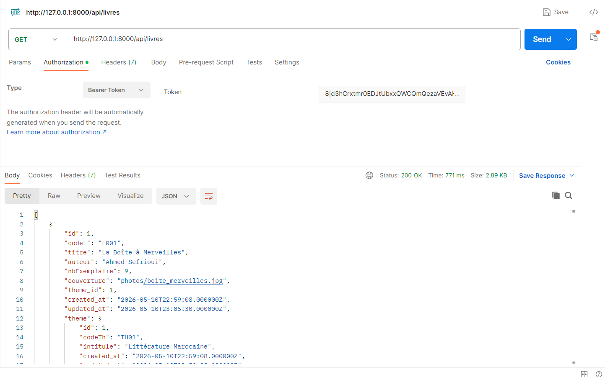
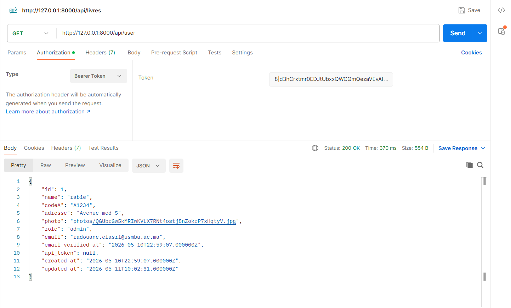
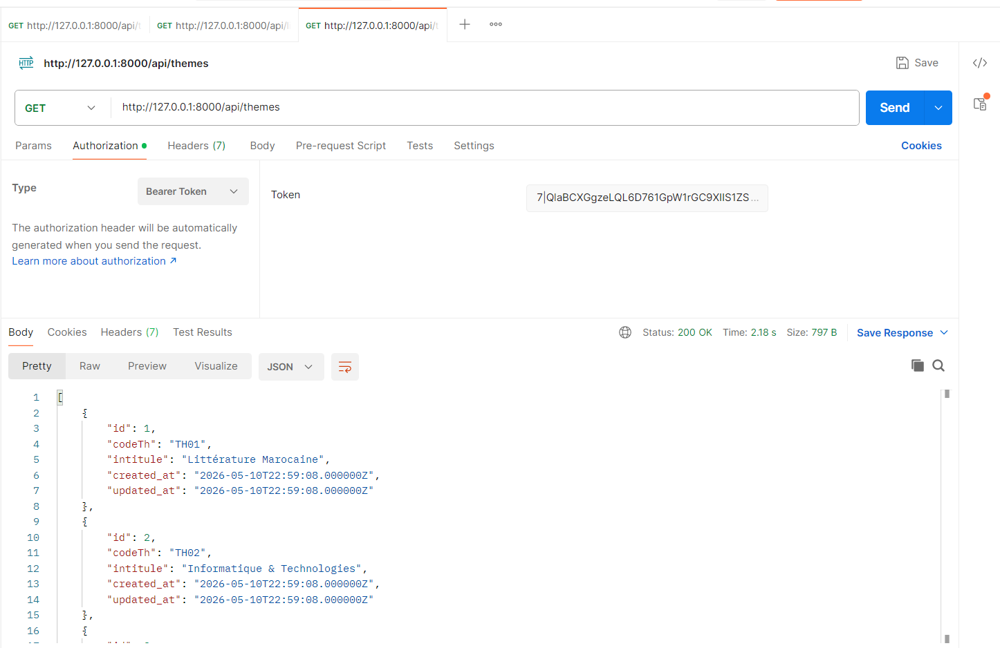
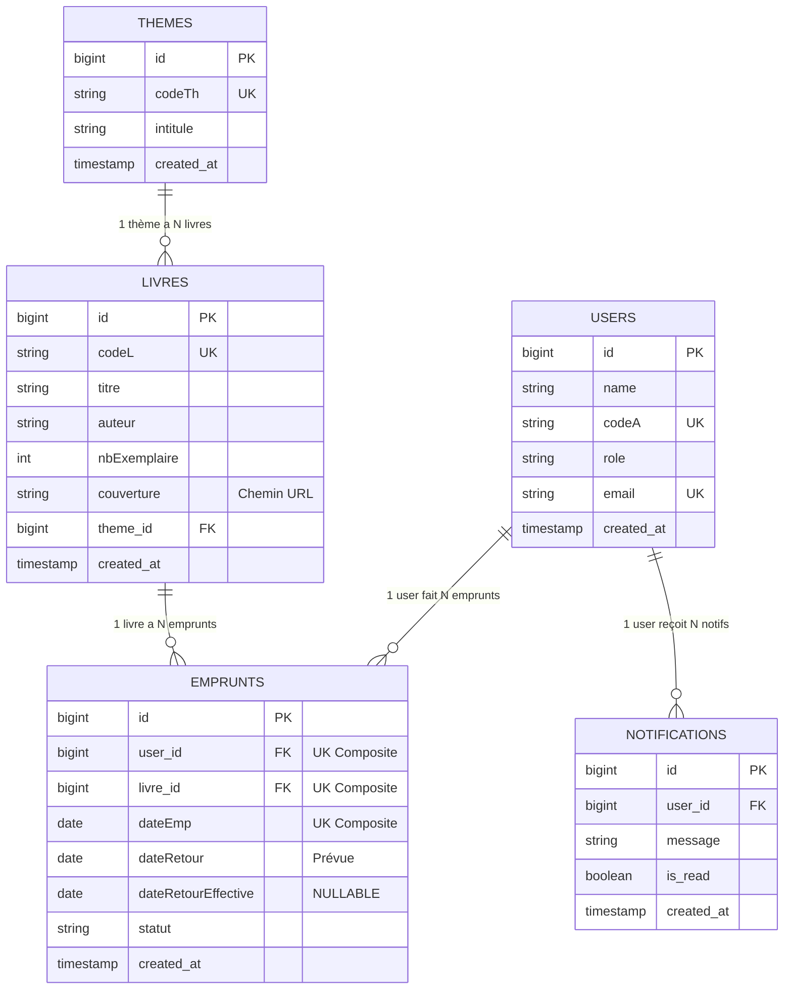

# 📚 SmartLibrary — Système de Gestion de Bibliothèque Premium

<p align="center">
  
  
  
  
  
</p>

> **SmartLibrary** est une application web moderne et professionnelle de gestion de bibliothèque, **entièrement conçue et développée par Radouane EL-ASRI et ElAttar Soufi Rabie**. Pensée pour offrir une expérience utilisateur haut de gamme (Premium), elle automatise la gestion des emprunts, centralise la communication par email, et propose une interface utilisateur à la pointe des standards actuels.

---

## 🌟 Nouvelles Fonctionnalités & Mises à Jour Récentes

Le projet a récemment bénéficié d'une refonte majeure pour le rendre **100% prêt pour la production**. Voici tout ce qui a été ajouté :

### 1. 📧 Système d'Emails HTML Centrés & Premium
Tous les emails générés par l'application ont été transformés en véritables templates HTML professionnels (centrés, responsives, avec dégradés et cartes d'informations) :
- **Confirmation de réservation** (Envoyée à l'adhérent).
- **Refus de réservation** (Envoyée à l'adhérent suite au choix de l'admin).
- **Validation de retour** (Confirmation de bonne réception).
- **Rappels automatiques de retard** (Alerte visuelle rouge).
- **Rappels manuels** (Alerte visuelle orange déclenchée par l'admin).
- **Notification Admin** (Alerte à l'administrateur lors d'une nouvelle demande).
- **Réinitialisation de mot de passe** (Design sécurisé et moderne).

### 2. 👤 Gestion Avancée du Profil
- **Menu Déroulant Intelligent :** Un menu profil complet dans la barre de navigation avec la photo de l'utilisateur, son rôle, et son statut de connexion (point vert en ligne).
- **Modification de Profil :** L'utilisateur peut mettre à jour ses coordonnées, changer son mot de passe en toute sécurité, et uploader une photo de profil (avec avatar par défaut automatique).
- **Stockage Sécurisé :** Utilisation du `storage:link` de Laravel pour la gestion optimisée des fichiers.

### 3. 🎨 Design UI/UX et Mode Sombre (Dark Mode)
- **Dark Mode Intégré :** Bouton pour basculer l'application en mode sombre (persistance avec `localStorage`).
- **Barre de Navigation Glassmorphism :** Refonte totale pour un aspect flouté ultra-moderne et aéré.
- **Assistant Virtuel (Chatbot UI) :** Interface flottante de chatbot "Pulse AI", prête à orienter l'utilisateur.

### 4. 🛡️ Sécurité & Authentification Avancée (RBAC)
- **Authentification & Hachage :** Mots de passe fortement hachés par algorithme `Bcrypt`.
- **Réinitialisation autonome :** Envoi d'un token sécurisé par email en cas de perte de mot de passe.
- **Middlewares stricts :** Création du middleware `AdminOnly` empêchant tout accès non autorisé aux dashboards de gestion.
- **Protection CSRF & Injections SQL :** Requêtes sécurisées via Eloquent ORM.

### 5. 📊 Exports & Rapports (Outils Admin)
- **Génération PDF :** Création de reçus PDF pour chaque emprunt validé (`barryvdh/laravel-dompdf`).
- **Exportation CSV :** Possibilité de télécharger la liste complète de l'historique des emprunts au format Excel/CSV.
- **Rapport Mensuel :** Synthèse analytique du mois en PDF.

---

## 🏗️ Architecture du Projet

Voici l'arborescence complète et détaillée décrivant le rôle exact de chaque dossier et fichier clé du système :

```text
Gestio Bib Laravel/
├── app/
│   ├── Http/
│   │   ├── Controllers/
│   │   │   ├── AdherentController.php   ← CRUD Adhérents, gestion des profils & modification d'image
│   │   │   ├── AuthController.php       ← Logique de Connexion, Inscription, Déconnexion et Reset Password
│   │   │   ├── DashboardController.php  ← Calcul des statistiques et métriques pour la vue Administrateur
│   │   │   ├── EmpruntController.php    ← Cœur du métier : Réservations, retours, exports PDF/CSV, Emails
│   │   │   ├── LivreController.php      ← CRUD complet du catalogue des livres avec gestion des images
│   │   │   └── ThemeController.php      ← Gestion des thèmes/catégories
│   │   └── Middleware/
│   │       ├── AdminOnly.php            ← Barrière de sécurité bloquant l'accès aux non-administrateurs
│   │       ├── ApiTokenMiddleware.php   ← Vérification des tokens API Sanctum
│   │       ├── ConnexionMiddleware.php  ← Vérification du statut de connexion
│   │       └── EmpruntMiddleware.php    ← Validation des règles d'emprunt
│   ├── Mail/                          ← Templates des classes d'envoi d'emails (Mailable)
│   │   ├── AdminNouvelleReservation.php, AlertMail.php, ConfirmationRetour.php, 
│   │   ├── LateBookNotification.php, RappelManuel.php, RappelRetour.php, 
│   │   └── ReservationConfirmation.php, ReservationRefusee.php, ResetPasswordMail.php
│   ├── Models/
│   │   ├── Emprunt.php      ← Modèle Pivot. Gère les dates, statuts et relations Livre/User
│   │   ├── Livre.php        ← Modèle des livres du catalogue
│   │   ├── Notification.php ← Modèle gérant les alertes internes (cloche de notification)
│   │   ├── Theme.php        ← Modèle des catégories
│   │   └── User.php         ← Modèle Adhérent/Administrateur avec gestion des tokens Sanctum
│   ├── Policies/                      ← Règles d'autorisation fines (RBAC) pour chaque modèle
│   │   ├── EmpruntPolicy.php, LivrePolicy.php, ThemePolicy.php, UserPolicy.php
│   └── Providers/
│       └── AppServiceProvider.php     ← Configuration globale de l'application (Paginator, Gates)
├── config/
│   ├── sanctum.php          ← Configuration de l'API Sanctum (Tokens, expiration)
│   ├── mail.php             ← Configuration du serveur SMTP pour l'envoi d'emails
│   └── auth.php             ← Configuration de l'authentification et des guards
├── database/
│   ├── migrations/          ← Définition du schéma des 8 tables SQL (relations, cascades, index)
│   └── seeders/
│       └── DatabaseSeeder.php ← Jeu de données de test (Admin, adhérent, livres par défaut injectés)
├── resources/
│   └── views/
│       ├── adherents/       ← Vues liées à la gestion et au profil des adhérents
│       ├── auth/            ← Vues de connexion, inscription et mot de passe oublié
│       ├── emails/          ← Contient tous les templates HTML Premium (Rappels, Confirmations, etc.)
│       ├── emprunts/        ← Vues de gestion des emprunts, historiques et exports PDF
│       ├── errors/          ← Pages d'erreurs personnalisées (403, 404, etc.)
│       ├── layouts/
│       │   └── _pageLayout.blade.php ← Le squelette maître du site (Navbar, Dark Mode JS, Footer, Chatbot)
│       ├── livres/          ← Vues du catalogue et de gestion CRUD des livres
│       ├── themes/          ← Vues de gestion des catégories
│       ├── acceuil.blade.php  ← Page d'accueil publique de la bibliothèque
│       ├── dashboard.blade.php ← Tableau de bord principal (Statistiques Administrateur)
│       └── welcome.blade.php   ← Vue alternative/fallback
├── routes/
│   ├── api.php              ← Définition des endpoints REST sécurisés par le token Bearer Sanctum
│   ├── console.php          ← Commandes Artisan et tâches planifiées (ex: envoi des rappels automatiques)
│   └── web.php              ← Définition des routes principales protégées par middlewares (auth, admin)
└── composer.json            ← Dépendances du projet (DomPDF, Sanctum, etc.)
```

---

## ⚡ Tests API avec Postman (Laravel Sanctum)

L'application expose une API RESTful sécurisée par **Laravel Sanctum**. Si vous souhaitez interroger la bibliothèque depuis une autre application ou en local, voici les 4 endpoints principaux à tester dans Postman :

### 1. Générer le Token (Authentification Rapide)
- **Méthode :** `GET`
- **URL :** `http://127.0.0.1:8000/api/dev-token`
- **Description :** Cette route de test génère un Token d'accès (Bearer Token) pour le premier utilisateur de la base de données et nettoie les anciens.
- **Réponse :** Une chaîne de caractères (le token). **Copiez ce token pour les étapes suivantes.**

### 2. Récupérer le catalogue des livres complet
- **Méthode :** `GET`
- **URL :** `http://127.0.0.1:8000/api/livres`
- **Autorisation (Onglet Authorization dans Postman) :**
  - Type : `Bearer Token`
  - Token : *Collez le token récupéré à l'étape 1*-
  - Par exemple : "8|d3hCrxtmr0EDJtUbxxQWCQmQezaVEvAHtran2M5Tb67d77b7"
  - **Description :** Retourne la liste complète des livres avec les détails de leurs thèmes respectifs au format JSON.


### 3. Vérifier le profil de l'utilisateur connecté
- **Méthode :** `GET`
- **URL :** `http://127.0.0.1:8000/api/user`
- **Autorisation (Onglet Authorization) :**
  - Type : `Bearer Token`
  - Token : *Collez le token récupéré à l'étape 1*
  - Par exemple : "8|d3hCrxtmr0EDJtUbxxQWCQmQezaVEvAHtran2M5Tb67d77b7" 
- **Description :** Renvoie les informations strictement confidentielles de l'utilisateur possédant le token (Nom, Email, Rôle).


### 4. Récupérer la liste des thèmes (catégories)
- **Méthode :** `GET`
- **URL :** `http://127.0.0.1:8000/api/themes`
- **Autorisation (Onglet Authorization) :**
  - Type : `Bearer Token`
  - Token : *Collez le token récupéré à l'étape 1* 
  par exemple : "7|QlaBCXGgzeLQL6D761GpW1rGC9XIIS1ZSBzaRim227e938be"
- **Description :** Retourne la liste complète de tous les thèmes/catégories de livres disponibles au format JSON.


---

## 🗄️ Schéma de la Base de Données (Version Finale)

> **6 tables métier + 2 tables système** — Toutes les relations sont gérées par des clés étrangères avec contraintes `CASCADE`.



━━━━━━━━━━━━━━━━━━━━━━━━━━━ TABLES SYSTÈME ━━━━━━━━━━━━━━━━━━━━━━━━━━━━━━━━

```text
┌──────────────────────────────────────────────┐   ┌──────────────────────────────────────────┐
│          personal_access_tokens              │   │          password_reset_tokens            │
│                 (Sanctum API) 🆕             │   │            (Reset mot de passe)          │
├──────────────────────────────────────────────┤   ├──────────────────────────────────────────┤
│ id              (PK)                         │   │ email      (PK, STRING)                  │
│ tokenable_type  (STRING) ← morph            │   │ token      (STRING)                      │
│ tokenable_id    (BIGINT) ← morph            │   │ created_at (TIMESTAMP, NULLABLE)         │
│ name            (TEXT)                       │   └──────────────────────────────────────────┘
│ token           (STRING 64, UNIQUE)          │
│ abilities       (TEXT, NULLABLE)             │   ┌──────────────────────────────────────────┐
│ last_used_at    (TIMESTAMP, NULLABLE)        │   │                 sessions                  │
│ expires_at      (TIMESTAMP, NULLABLE)        │   ├──────────────────────────────────────────┤
│ created_at / updated_at                      │   │ id           (PK, STRING)                │
└──────────────────────────────────────────────┘   │ user_id      (FK → users.id, NULLABLE)  │
                                                   │ ip_address   (STRING 45, NULLABLE)       │
                                                   │ user_agent   (TEXT, NULLABLE)             │
                                                   │ payload      (LONGTEXT)                  │
                                                   │ last_activity (INTEGER)                  │
                                                   └──────────────────────────────────────────┘
```

---

## 🚀 Installation Express & Configuration

1. **Cloner le projet** et démarrer votre serveur local (ex: XAMPP).
2. **Base de données :** Créer une base nommée `Gestion_biblio`.
3. **Commandes d'initialisation :**
   Dans le terminal du projet, exécutez ces commandes l'une après l'autre :
   ```bash
   composer install
   npm install
   cp .env.example .env
   php artisan key:generate
   php artisan migrate:fresh --seed
   ```
4. **Lien de stockage (TRÈS IMPORTANT pour les photos de profil) :**
   ```bash
   php artisan storage:link
   ```
5. **Configuration Email (.env) via GMAIL SMTP :**
   Le système est configuré pour envoyer de vrais emails (Confirmation, Réservation, Rappels).
   Dans votre fichier `.env`, configurez ces paramètres :
   ```env
   MAIL_MAILER=smtp
   MAIL_HOST=smtp.gmail.com
   MAIL_PORT=465
   MAIL_USERNAME=votre_adresse@gmail.com
   MAIL_PASSWORD=votre_mot_de_passe_d_application
   MAIL_ENCRYPTION=smtps
   MAIL_FROM_ADDRESS=votre_adresse@gmail.com
   MAIL_FROM_NAME="SmartLibrary"
   ```
6. **Lancement de l'application :**
   ```bash
   php artisan serve
   ```

---

## 🎬 Scénarios d'Utilisation (Workflow)

### Scénario 1 : Le nouvel adhérent réserve un livre
1. **L'Adhérent** crée son compte via la page d'inscription.
2. Il arrive sur le **Catalogue**, cherche un livre ("Harry Potter" par exemple) et clique sur **"Réserver"**.
3. **Résultat :** Il reçoit instantanément un **email premium** lui confirmant que sa demande a été envoyée à l'administrateur.

### Scénario 2 : L'Admin valide la demande
1. **L'Administrateur** se connecte et voit une notification sur son Dashboard.
2. Il va dans "Emprunts", trouve la demande en statut "En attente", et clique sur **"Valider"**.
3. **Résultat :** L'adhérent reçoit un **email de validation** lui indiquant qu'il peut venir chercher le livre, avec la date limite de retour, et l'administrateur peut générer le reçu **PDF**.

### Scénario 3 : Le Retour et les Retards
- **Option A (Rendu) :** L'adhérent ramène le livre, l'Admin clique sur **"Marqué comme Rendu"**. L'adhérent reçoit un email le remerciant.
- **Option B (Retard) :** L'Admin clique sur le bouton **"Rappeler"**. L'adhérent reçoit immédiatement une **alerte rouge par email**.

---

## 🔑 Comptes de Test (Générés par le Seeder)

| Rôle | Email | Mot de passe |
|---|---|---|
| **Administrateur** | [EMAIL_ADDRESS] 
| **Adhérent** | [EMAIL_ADDRESS] 

## 👨‍💻 Développeurs & Auteurs
- **Radouane EL-ASRI** — Architecture & Backend & Logique Emails
- **ElAttar Soufi Rabie** — Design UI/UX, Frontend Premium

---
<p align="center">Fait avec ❤️, passion, et Laravel</p>